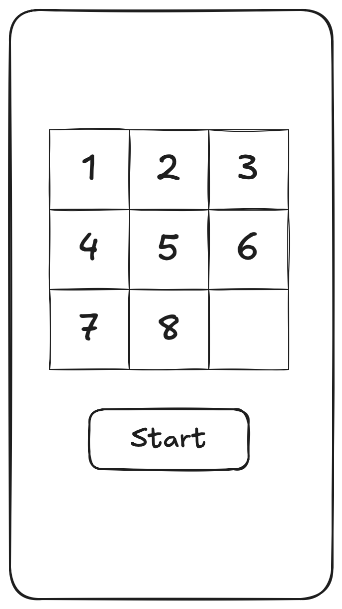
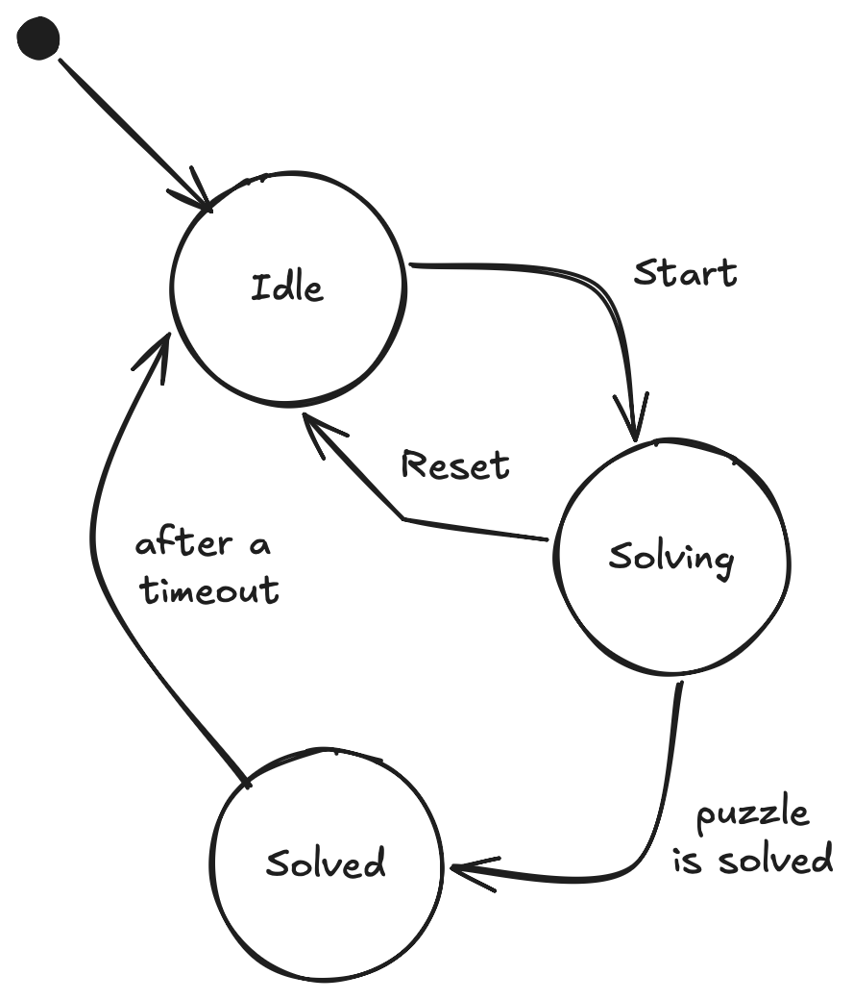

# 8-Puzzle Design Documentation

This document outlines the visual and behavioral design of the 8-puzzle application.

## 1. User Interface Design

The Play Screen follows a minimalist 3x3 grid layout as envisioned in our initial conceptual sketch. The design focuses on high readability and clear action points.

### Initial UI Sketch

## 2. Behavioral Logic (State Machine)

The application's logic is modeled as a formal state machine to ensure predictable transitions and a robust user experience.

### Play Screen State Machine

### State Descriptions
- **Idle**: The initial state. Shows a solved board. The "Start" button is active.
- **Solving**: Triggered when the user clicks "Start". The board is shuffled and tiles become interactive. A "Reset" button allows returning to Idle.
- **Solved**: Automatically entered when the user solves the puzzle. Displays a congratulations message and automatically returns to **Idle** after a 3-second timeout.
