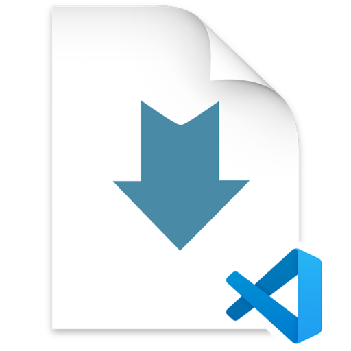

# My Game Vault Android Demo

A greenfield Android application used as a progressive demo for mobile development lectures.

## Important for AI Agents
Before contributing to this repository, you **must** read and follow the [GUIDELINES.md](./GUIDELINES.md). 
This project follows an incremental architectural approach; do not jump ahead to advanced patterns (like DI) 
unless the guidelines explicitly allow them for the current iteration.

## Project Structure
- `app/`: Main Android application module.
- `core/`: Domain-specific logic.
- `docs/`: Design and architectural documentation.
- `GUIDELINES.md`: Current architectural boundaries and testing requirements.
